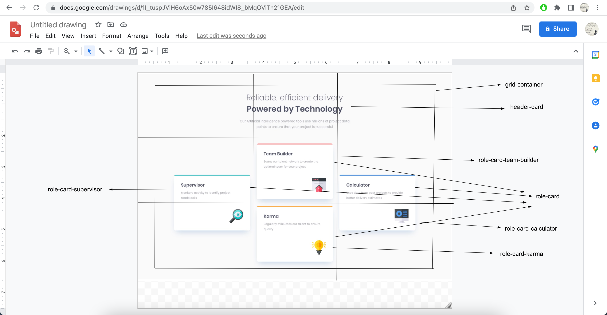
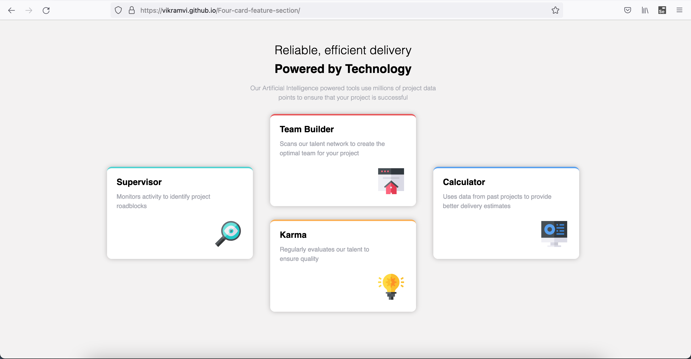
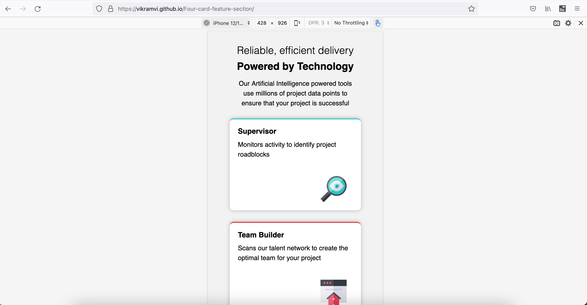

# Frontend Mentor - Four card feature section solution

This is a solution to the [Four card feature section challenge on Frontend Mentor](https://www.frontendmentor.io/challenges/four-card-feature-section-weK1eFYK). Frontend Mentor challenges help you improve your coding skills by building realistic projects.

## Table of contents

- [Overview](#overview)
  - [The challenge](#the-challenge)
  - [Screenshot](#screenshot)
  - [Links](#links)
- [My process](#my-process)
  - [Built with](#built-with)
  - [What I learned](#what-i-learned)
  - [Continued development](#continued-development)
  - [Useful resources](#useful-resources)
- [Author](#author)
- [Acknowledgments](#acknowledgments)

## Overview

This is 8th project from "Frontend Mentor" to sharpen HTML & CSS skills along with responsive web design and it's build with "BEM" and "Grid layout".

### The challenge

Users should be able to:

- View the optimal layout for the site depending on their device's screen size

### Screenshot

### Links

- [Live Site URL](https://vikramvi.github.io/Four-card-feature-section/)

## My process

### Built with

- Semantic HTML5 markup
- CSS BEM
- CSS Grid
- Mobile-first workflow

### What I learned

- CSS "Grid" and "BEM" are best techniques to solve any complex design styling
- This helps with magic numbers being used in margin, padding etc
- No need to use CSS position at all
- More learnings wrt CSS Grid items positioning and aligning
- More learnings wrt CSS width & best practices
- More learnings wrt Semantic HTML
- In FF devtool, you can modify height, width with scroll bar kind of action

### Continued development

- More practice, reading, study is needed wrt BEM, SEO, Accessibility, CSS

### Useful resources

- Google ofcourse
- YT videos
- Stackoverflow
- Frontend Mentor slack community

## Author

- Frontend Mentor - [@vikramvi](https://www.frontendmentor.io/profile/vikramvi)

## Acknowledgments

- FM community
- Google
- SO community
- YT content creators
